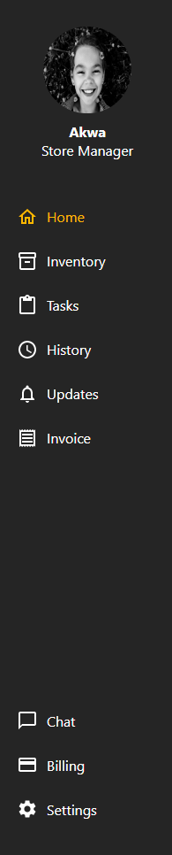

# Right Side Bar

## Description

This component is used mainly to navigate the dashboard. It consists of the user image and navigation links to different sections of the app

### Fig 1.0.0



## Imports

from **_"react-router-dom"_**

- NavLink
- useNavigate

from **_"firebase/auth"_**

- auth
- signOut

from **_"react-redux"_**

- useSelector
- useState

from **_"@mui/icons-material"_**

- HomeOutlined
- Inventory2Outlined
- ContentPasteOutlined
- AccessTime
- NotificationsOutlined
- ReceiptOutlined
- ChatBubbleOutline
- Settings
- CreditCard

from **_"styled-components"_**

- styled

### Code Example

---

```js
import { Navigate, NavLink, useNavigate } from "react-router-dom";
import { signOut } from "firebase/auth";
import auth from "../../util/firebase-auth";
import { useSelector } from "react-redux";
import { useState } from "react";
import {
  HomeOutlined,
  Inventory2Outlined,
  ContentPasteOutlined,
  AccessTime,
  NotificationsOutlined,
  ReceiptOutlined,
  ChatBubbleOutline,
  Settings,
  CreditCard,
} from "@mui/icons-material";
import styled from "styled-components";
```

## Functions

---

### toggleSignout

This function is responsible for toggling the signout menu

```js
const toggleSignOut = (event) => {
  setSignOutIsActive(!signOutIsActive);
};
```

### toggleSignout

This function is responsible for logging out the user from the app dashboard and navigating to the signin screen.

```js
const handleSignout = (event) => {
  toggleSignOut(event);
  signOut(auth).then(() => {
    navigate("/signin");
  });
};
```

### Render

---

```js
<RSideBar>
  <div className="user-info">
    <UserImg src="/images/user1.jpg" onClick={toggleSignOut} />
    {signOutIsActive && (
      <SignOut
        className="animate__animated animate__fadeIn"
        onClick={handleSignout}
        onMouseLeave={toggleSignOut}
      >
        Signout
      </SignOut>
    )}
    <h4 className="userName"> {!signOutIsActive && <span>{UserName}</span>}</h4>
    {!signOutIsActive && <p>Store Manager</p>}
  </div>

  <div className="menu">
    <ul>
      <li>
        <NavLink
          className={({ isActive }) => (isActive ? "isActiveLink" : "")}
          to="/dashboard/home"
        >
          <HomeOutlined />
          <span>Home</span>
        </NavLink>
      </li>
      <li>
        <NavLink
          className={({ isActive }) => (isActive ? "isActiveLink" : "")}
          to="/dashboard/inventory"
        >
          <Inventory2Outlined />
          <span>Inventory</span>
        </NavLink>
      </li>
      <li>
        <NavLink
          className={({ isActive }) => (isActive ? "isActiveLink" : "")}
          to="/dashboard/tasks"
        >
          <ContentPasteOutlined />
          <span>Tasks</span>
        </NavLink>
      </li>
      <li>
        <NavLink
          className={({ isActive }) => (isActive ? "isActiveLink" : "")}
          to="/dashboard/history"
        >
          <AccessTime />
          <span>History</span>
        </NavLink>
      </li>
      <li>
        <NavLink
          className={({ isActive }) => (isActive ? "isActiveLink" : "")}
          to="/dashboard/updates"
        >
          <NotificationsOutlined />
          <span>Updates</span>
        </NavLink>
      </li>
      <li>
        <NavLink
          className={({ isActive }) => (isActive ? "isActiveLink" : "")}
          to="/dashboard/invoice"
        >
          <ReceiptOutlined />
          <span>Invoice</span>
        </NavLink>
      </li>
    </ul>
  </div>

  <div className="extraMenu">
    <ul>
      <li>
        <NavLink
          className={({ isActive }) => (isActive ? "isActiveLink" : "")}
          to="/dashboard/chat"
        >
          <ChatBubbleOutline />
          <span>Chat</span>
        </NavLink>
      </li>
      <li>
        <NavLink
          className={({ isActive }) => (isActive ? "isActiveLink" : "")}
          to="/dashboard/billing"
        >
          <CreditCard />
          <span>Billing</span>
        </NavLink>
      </li>
      <li>
        <NavLink
          className={({ isActive }) => (isActive ? "isActiveLink" : "")}
          to="/dashboard/settings"
        >
          <Settings />
          <span>Settings</span>
        </NavLink>
      </li>
    </ul>
  </div>
</RSideBar>
```
